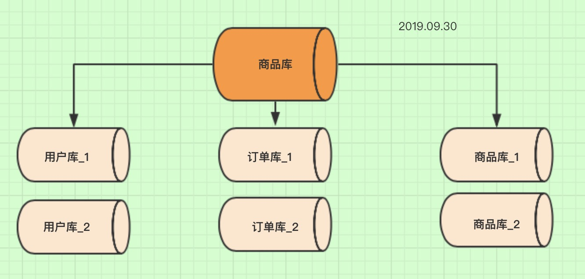
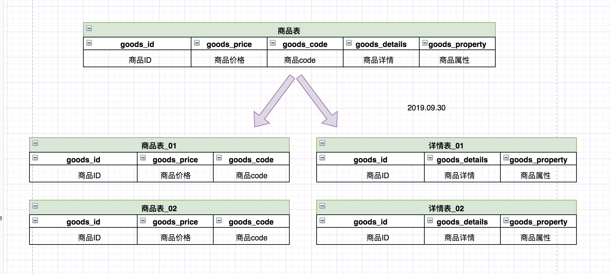
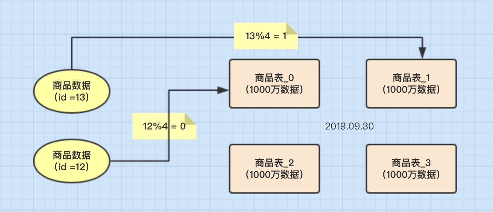
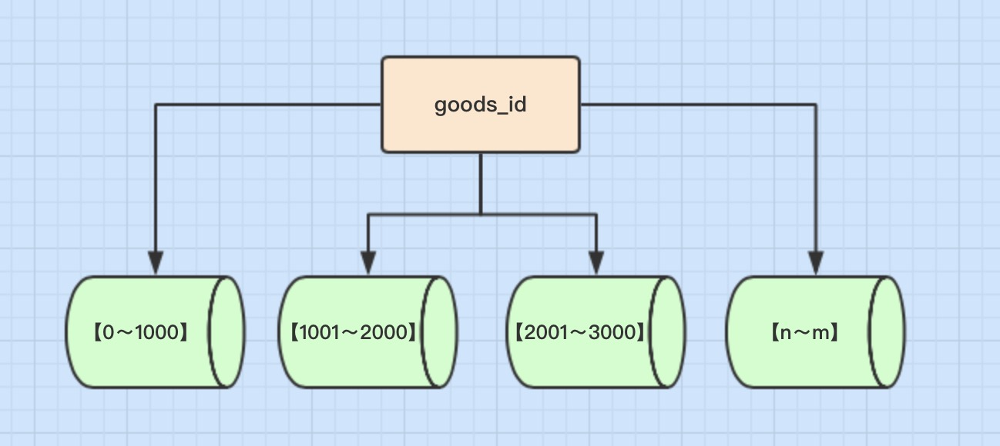

# 分库分表理论
当一张表的数据达到几千万时，查询一次所花的时间会变长。业界公认MySQL单表容量在 1千万 以下是最佳状态，因为这时它的BTREE索引树高在3~5之间。

数据切分可以分为：
- 垂直切分
- 水平切分

## 一、垂直切分
垂直切分又可以分为: **垂直分库**和**垂直分表**。

### 1.1. 垂直分库
**概念**：
就是根据业务耦合性，将关联度低的不同表存储在不同的数据库。做法与大系统拆分为多个小系统类似，按业务分类进行独立划分。与“微服务治理”的做法相似， 每个微服务使用单独的一个数据库。

**说明**：
一开始我们是单体服务，所以只有一个数据库，所有的表都在这个库里。 后来因为业务需求,单体服务变成微服务治理。所以将之前的一个商品库，拆分成多个数据库。每个微服务对于一个数据库。

### 1.2. 垂直分表
**概念**：把一个表的多个字段分别拆成多个表，一般按字段的冷热拆分，热字段一个表，冷字段一个表，**从而提升了数据库性能**。

**说明**：
一开始商品表中包含商品的所有字段，但是我们发现:

1.商品详情和商品属性字段较长。 
2.商品列表的时候我们是不需要显示商品详情和商品属性信息，只有在点进商品商品的时候才会展示商品详情信息。

所以可以考虑把商品详情和商品属性单独切分一张表，提高查询效率。

### 1.3. 垂直切分优缺点
#### 优点
- 解决业务系统层面的耦合，业务清晰
- 与微服务的治理类似，也能对不同业务的数据进行分级管理、维护、监控、扩展等
- 高并发场景下，垂直切分一定程度的提升IO、数据库连接数、单机硬件资源的瓶颈
#### 缺点
- 分库后无法Join，只能通过接口聚合方式解决，提升了开发的复杂度
- 分库后分布式事务处理复杂
- 依然存在单表数据量过大的问题（需要水平切分）

## 二、水平切分
当一个应用难以再细粒度的垂直切分或切分后数据量行数巨大,存在单库读写、存储性能瓶颈，这时候就需要进行水平切分了。

水平切分也可以分为：水平分库和水平分表。

### 2.1. 水平分库
**概念**：
上面虽然已经把商品库分成3个库，但是随着业务的增加一个订单库也出现QPS过高，数据库响应速度来不及，一般mysql单机也就1000左右的QPS，如果超过1000就要考虑分库。

### 2.2. 水平分表
**概念**：
一般我们一张表的数据不要超过1千万，如果表数据超过1千万，并且还在不断增加数据，那就可以考虑分表。

### 2.3. 水平切分优缺点
#### 优点
- 不存在单库数据量过大、高并发的性能瓶颈，提升系统稳定性和负载能力
- 应用端改造较小，不需要拆分业务模块
#### 缺点
- 跨分片的事务一致性难以保证
- 跨库的Join关联查询性能较差
- 数据多次扩展难度和维护量极大

## 三、数据分片规则
我们考虑去水平切分表，将一张表水平切分成多张表，这就涉及到数据分片的规则，比较常见的有以下3种：
- Hash取模分表
- 数值Range分表
- 一致性Hash算法分表

### 3.1. Hash取模分表
**概念**：
一般采用Hash取模的切分方式，例如：假设按goods_id分4张表。（goods_id % 4 取整确定表）

#### 优点
- 数据分片相对比较均匀，不容易出现热点和并发访问的瓶颈。
#### 缺点
- 后期分片集群扩容时，需要迁移旧的数据很难。
- 容易面临跨分片查询的复杂问题。比如上例中，如果频繁用到的查询条件中不带goods_id时，将会导致无法定位数据库，从而需要同时向4个库发起查询，
  再在内存中合并数据，取最小集返回给应用，分库反而成为拖累。

### 3.2. 数值Range分表
**概念**：
按照时间区间或ID区间来切分。例如：将goods_id为11000的记录分到第一个表，10012000的分到第二个表，以此类推。

#### 优点
- 单表大小可控
- 天然便于水平扩展，后期如果想对整个分片集群扩容时，只需要添加节点即可，无需对其他分片的数据进行迁移
- 使用分片字段进行范围查找时，连续分片可快速定位分片进行快速查询，有效避免跨分片查询的问题。

#### 缺点
- 热点数据成为性能瓶颈。（例如按时间字段分片，有些分片存储最近时间段内的数据，可能会被频繁的读写，而有些分片存储的历史数据，则很少被查询）

### 3.3. 一致性Hash算法
一致性Hash算法能很好的解决因为Hash取模而产生的分片集群扩容时，需要迁移旧的数据的难题。

## 四、分库分表带来的问题
任何事情都有两面性，分库分表也不例外，如果采用分库分表，会引入新的的问题

### 4.1. 分布式事务问题
使用分布式事务中间件解决，具体是通过最终一致性还是强一致性分布式事务，看业务需求，这里就不多说。

### 4.2. 跨节点关联查询 Join 问题
切分之前，我们可以通过Join来完成。而切分之后，数据可能分布在不同的节点上，此时Join带来的问题就比较麻烦了，考虑到性能，尽量避免使用Join查询。

**解决这个问题的一些方法：**
#### 全局表
全局表，也可看做是“数据字典表”，就是系统中所有模块都可能依赖的一些表，为了避免跨库Join查询，可以将这类表在每个数据库中都保存一份。这些数据通常很少会进行修改，所以也不担心一致性的问题。

#### 字段冗余
利用空间换时间，为了性能而避免join查询。例：订单表保存userId时候，也将userName冗余保存一份，这样查询订单详情时就不需要再去查询“买家user表”了。

#### 数据组装
在系统层面，分两次查询。第一次查询的结果集中找出关联数据id，然后根据id发起第二次请求得到关联数据。最后将获得到的数据进行字段拼装。

### 4.3. 跨节点分页、排序、函数问题
跨节点多库进行查询时，会出现Limit分页、Order by排序等问题。分页需要按照指定字段进行排序，当排序字段就是分片字段时，通过分片规则就比较容易定位到指定的分片。

当排序字段非分片字段时，就变得比较复杂了。需要先在不同的分片节点中将数据进行排序并返回，然后将不同分片返回的结果集进行汇总和再次排序，最终返回给用户。

### 4.4. 全局主键避重问题
如果都用主键自增肯定不合理，如果用UUID那么无法做到根据主键排序，所以我们可以考虑通过雪花ID来作为数据库的主键，

### 4.5. 数据迁移问题
采用双写的方式，修改代码，所有涉及到分库分表的表的增、删、改的代码，都要对新库进行增删改。同时，再有一个数据抽取服务，不断地从老库抽数据，往新库写，边写边按时间比较数据是不是最新的。

## 五、参考
- [1. 分库分表](https://www.jianshu.com/p/89fa2f873afe)
- [2. 谈谈分库分表吧？](https://baijiahao.baidu.com/s?id=1622441635115622194&wfr=spider&for=pc)
- [3. 数据库分库分表思路](https://www.cnblogs.com/butterfly100/p/9034281.html)