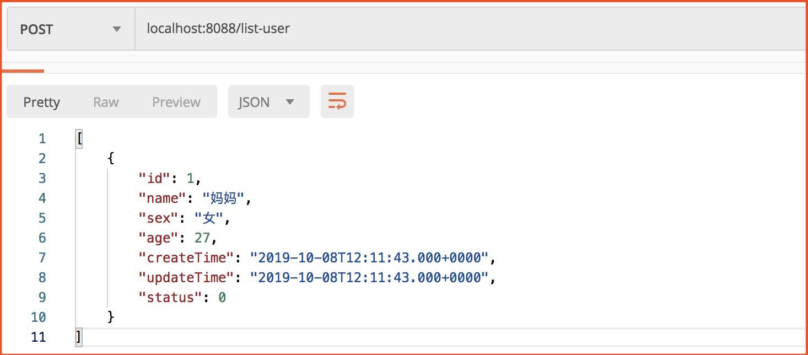

# SpringBoot + Sharding Sphere 实现读写分离
## 一、项目概述
### 1.1. 项目说明
**场景：** 如果实际项目中Mysql是 Master-Slave (主从)部署的，那么数据保存到 Master 库，Master 库数据同步数据到Slave库，数据读取到Slave库，这样可以减缓数据库的压力。

### 1.2. 数据库设计
我们这个项目中Mysql服务器并没有实现主从部署,而是同一个服务器建立两个库，一个做 Master 库，一个做 Slave 库。

所以这里是不能实现的功能就是 Master 库新增数据主动同步到Slave库。这样也更有利于我们测试看效果。

#### Master 库


#### Slave 库


从两幅图中可以看出，我这里在同一个服务器建两个数据库来模拟主从数据库。为了方便看测试效果，这里主从数据库中的数据是不一样的。

## 二、核心代码
**说明：** 这里只贴出与技术相关的代码，完整代码请参考项目。

### 2.1. pom.xml
```xml
<properties>
    <java.version>1.8</java.version>
    <mybatis-spring-boot>2.0.1</mybatis-spring-boot>
    <project.build.sourceEncoding>UTF-8</project.build.sourceEncoding>
</properties>

<dependencies>
    <dependency>
        <groupId>org.springframework.boot</groupId>
        <artifactId>spring-boot-starter-web</artifactId>
    </dependency>
    <dependency>
        <groupId>org.mybatis.spring.boot</groupId>
        <artifactId>mybatis-spring-boot-starter</artifactId>
        <version>${mybatis-spring-boot}</version>
    </dependency>
    <!--mybatis驱动-->
    <dependency>
        <groupId>mysql</groupId>
        <artifactId>mysql-connector-java</artifactId>
    </dependency>
    <!--druid数据源-->
    <dependency>
        <groupId>com.alibaba</groupId>
        <artifactId>druid-spring-boot-starter</artifactId>
        <version>1.1.16</version>
    </dependency>
    <!--shardingsphere最新版本-->
    <dependency>
        <groupId>org.apache.shardingsphere</groupId>
        <artifactId>sharding-jdbc-spring-boot-starter</artifactId>
        <version>4.0.0-RC1</version>
    </dependency>
    <!--lombok实体工具-->
    <dependency>
        <groupId>org.projectlombok</groupId>
        <artifactId>lombok</artifactId>
    </dependency>
</dependencies>
```

### 2.2. application.properties
```properties
#指定mybatis信息
mybatis.config-location=classpath:mybatis-config.xml

spring.shardingsphere.datasource.names=master,slave0
# 数据源 主库
spring.shardingsphere.datasource.master.type=com.alibaba.druid.pool.DruidDataSource
spring.shardingsphere.datasource.master.driver-class-name=com.mysql.jdbc.Driver
spring.shardingsphere.datasource.master.url=jdbc:mysql://localhost:3306/master?characterEncoding=utf-8
spring.shardingsphere.datasource.master.username=root
spring.shardingsphere.datasource.master.password=123456
# 数据源 从库
spring.shardingsphere.datasource.slave0.type=com.alibaba.druid.pool.DruidDataSource
spring.shardingsphere.datasource.slave0.driver-class-name=com.mysql.jdbc.Driver
spring.shardingsphere.datasource.slave0.url=jdbc:mysql://localhost:3306/slave?characterEncoding=utf-8
spring.shardingsphere.datasource.slave0.username=root
spring.shardingsphere.datasource.slave0.password=123456

# 读写分离
spring.shardingsphere.masterslave.load-balance-algorithm-type=round_robin
spring.shardingsphere.masterslave.name=ms
spring.shardingsphere.masterslave.master-data-source-name=master
spring.shardingsphere.masterslave.slave-data-source-names=slave0
#打印sql
spring.shardingsphere.props.sql.show=true
```
Sharding-JDBC可以通过 Java、YAML、Spring命名空间和 Spring Boot Starter四种方式配置，开发者可根据场景选择适合的配置方式，具体可以看官网。

### 2.3. UserController
```java
@RestController
public class UserController {

    @Autowired
    private UserService userService;

    /**
     * 获取用户列表
     */
    @GetMapping("user/list")
    public Object userList() {
        return userService.list();
    }
    
    /**
     * 保存用户
     */
    @PostMapping("user/save")
    public Object saveUser() {
        return userService.saveOne(new User("小小", "女", 3));
    }
    
}
```

## 三、测试验证
## 3.1. 读数据



我们可以发现读取的数据是 Slave 库的数据，我们再来看控制台打印的SQL：可以看到读操作是Slave库。


## 3.2. 写数据
**请求接口：** 
`localhost:8088/user/save?name=小小&sex=女&age=3`

查看 Mater 数据库


发现 Master 数据库已经多了一条数据了，再看控制台打印的SQL：


这个时候如果去看 Slave 库的话这条新增的数据是没有的，因为没有同步过去。
