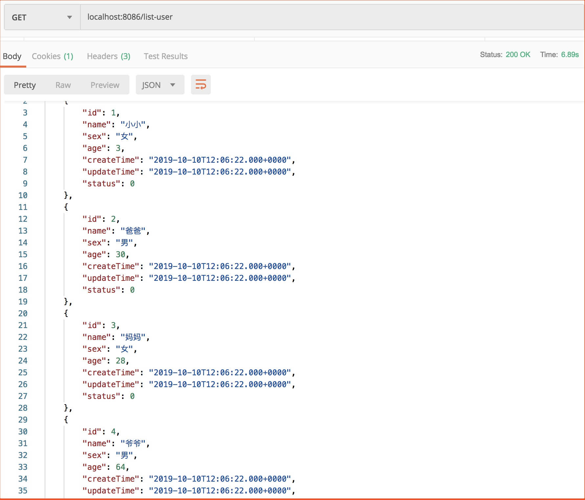

# SpringBoot + Sharding Sphere 实现分表
## 一、项目概述
### 1.1. 项目说明
**场景：** 在实际开发中，如果表的数据过大，我们可能需要把一张表拆分成多张表，这里就是通过 Sharding Sphere 实现分表功能，但不分库。

### 1.2. 数据库设计
这里有个 member 库，里面的 tab_user 表由一张拆分成3张，分别是 tab_user0、tab_user1、tab_user2。


## 二、核心代码

**说明：** 这里只贴出与技术相关的代码，完整代码请参考项目。

### 2.1. application.properties
```properties
server.port=8086

#指定mybatis信息
mybatis.config-location=classpath:mybatis-config.xml

spring.shardingsphere.datasource.names=master

# 数据源 主库
spring.shardingsphere.datasource.master.type=com.alibaba.druid.pool.DruidDataSource
spring.shardingsphere.datasource.master.driver-class-name=com.mysql.jdbc.Driver
spring.shardingsphere.datasource.master.url=jdbc:mysql://localhost:3306/member?characterEncoding=utf-8
spring.shardingsphere.datasource.master.username=root
spring.shardingsphere.datasource.master.password=123456

#数据分表规则
#指定所需分的表
spring.shardingsphere.sharding.tables.tab_user.actual-data-nodes=master.tab_user$->{0..2}
#指定主键
spring.shardingsphere.sharding.tables.tab_user.table-strategy.inline.sharding-column=id
#分表规则为主键除以3取模
spring.shardingsphere.sharding.tables.tab_user.table-strategy.inline.algorithm-expression=tab_user$->{id % 3}

#打印sql
spring.shardingsphere.props.sql.show=true
```
Sharding-JDBC可以通过 Java、YAML、Spring命名空间和 Spring Boot Starter四种方式配置，开发者可根据场景选择适合的配置方式，具体可以看官网。


### 2.2. UserController
```java
@RestController
public class UserController {

    @Autowired
    private UserService userService;

    /**
     * 获取用户列表
     */
    @GetMapping("list-user")
    public Object listUser() {
        return userService.list();
    }

    /**
     * 批量保存用户
     */
    @PostMapping("save-user")
    public Object saveUser() {
        List<User> users = Lists.newArrayList();
        users.add(new User("小小", "女", 3));
        users.add(new User("大大", "男", 5));
        users.add(new User("爸爸", "男", 30));
        users.add(new User("妈妈", "女", 28));
        users.add(new User("爷爷", "男", 64));
        users.add(new User("奶奶", "女", 62));
        return userService.insertForeach(users);
    }
}
```

## 三、测试验证
### 3.1. 批量插入数据
**请求接口：**
`localhost:8086/user/save`

我们可以从商品接口代码中可以看出，它会批量插入5条数据。我们先看控制台输出SQL语句。


我们可以从SQL语句可以看出 tab_user1 和 tab_user2 表插入了两条数据，而 tab_user0 表中插入一条数据。

我们再来看数据库：

**tab_user0：**


**tab_user1：**


**tab_user2：**


### 3.2. 获取数据
我们来获取列表的SQL，这里对SQL做了order排序操作，具体 Sharding Sphere 分表实现 Order 操作的原理可以看主页的 Sharding Sphere Blog 了解。

```MySQL
select *  from tab_user order by id
```
**请求接口结果：**



我们可以看出虽然已经分表，但依然可以将多表数据聚合在一起并可以排序。

**注意：** ShardingSphere并不支持CASE WHEN、HAVING、UNION (ALL)，有限支持子查询，这个官网有详细说明。
